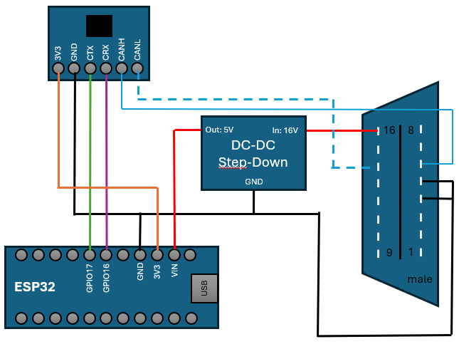

# ESP32-ScanMyTesla
CAN to BlueTooth Adapter for [ScanMyTesla](https://sites.google.com/view/scanmytesla/home) on ESP32

## Hardware
- Any ESP32 based board. (e.g. Wemos D1 mini ESP32), doesn't work with ESP32-C*, -S*, -H* series, only with ESP32
- Any DC-DC Step Down to 5V, because most ESP32 boards can't handle car voltages (~16V). (e.g. DC Power Shield for WEMOS D1 mini)
- SN65HVD230 CAN bus transceiver **without termination resistor**
- Tested with [Arduino ESP32 Core](https://github.com/espressif/arduino-esp32) v3.0.4
- Does NOT work with iOS. Apple doesn't Bluetooth Serial.

## Connection

